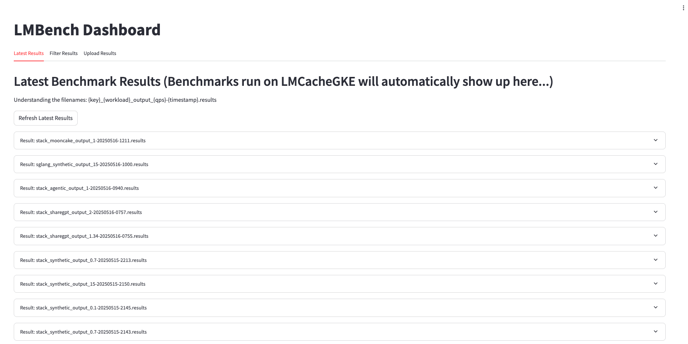
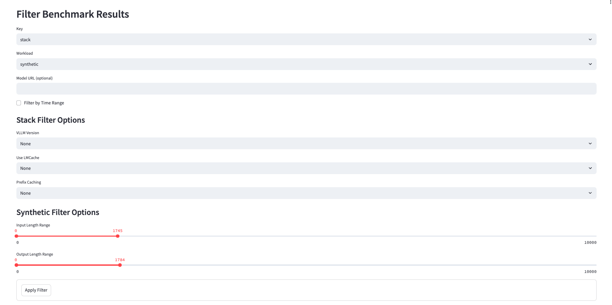
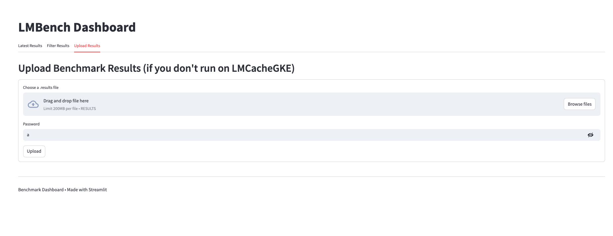

# LMBench: Kubernetes-based Online Inference Benchmarking.

## [Dashboard (lmbench.dev)](https://lmbench.dev/) to view/filter and submit latest results (if you run locally, if you run on the LMCache Runner, results will automatically show up).

### WARNING: Dashboard and artifact formats are under heavy refactoring!






# Running Benchmarks

### **Step 1:**

Write out your `bench-spec.yaml` with what Infrastructure, Serving Baseline, and Workload you are using. Reference `bench-spec-TEMPLATE.yaml` for configuration.

### **Step 2:**

**Option 1 (Recommended):** Submit a PR (or directly push if you have access) to LMCache/LMBench. You must have `Location: LMCacheGKE` set. There is only a single runner so your benchmark job may be queued.

**Option 2:** Clone to run on your local machine. You must have `Location: LocalMinike` set. Python dependencies for local installation are in `requirements.txt`. Feel free to upload your results to [lmbench.dev](https://lmbench.dev/)!

# E2E: From `bench-spec.yaml` to Artifacts

Every benchmark suite is **named** defined by a single `bench-spec.yaml`. You choose exactly one infrastructure. Then the suite runs the Cartesian Product of your Serving Baselines and all of your Workloads. The artifacts (one per baseline workload combination) are of the format:

`SUITENAME_KEY_WORKLOAD_QPS_TIME.json`

Examples:
```text
# artifacts from an example suite
example_layerwise_w_synthetic_0.7_20250529-0758.json
example_layerwise_w_synthetic_0.9_20250529-0826.json
example_layerwise_wo_synthetic_0.7_20250529-0910.json
example_layerwise_wo_synthetic_0.9_20250529-1053.json

# daily benchmarking
daily_routing_lmcache_roundrobin_agentic_0.2_20250529-1124.json
daily_routing_lmcache_session_agentic_0.2_20250529-1148.json
daily_routing_lmcache_sessionaware_agentic_0.2_20250529-1319.json
daily_routing_lmcache_kvaware_agentic_0.2_20250529-1523.json
```

Example Artifact: `example_layerwise_w_synthetic_0.7_20250529-0758.json`

```text
{
  "name": "layerwise-benchmark",
  "timestamp": "20250529-1246",
  "results": {
    "successful_requests": 99,
    "benchmark_duration_s": 98.74,
    "total_input_tokens": 9385,
    "total_generated_tokens": 1980,
    "request_throughput_req_per_s": 1.0,
    "output_token_throughput_tok_per_s": 20.05,
    "total_token_throughput_tok_per_s": 115.1,
    "ttft_ms": {
      "mean": 65.29,
      "median": 67.79,
      "p99": 109.8
    },
    "tpot_ms": {
      "mean": 10.74,
      "median": 10.48,
      "p99": 12.22
    },
    "itl_ms": {
      "mean": 13.47,
      "median": 13.5,
      "p99": 13.91
    }
  },
  "infra": {
    "Location": "LocalMinikube"
  },
  "serving": {
    "baseline_type": "Direct-ProductionStack",
    "config": {
      "kubernetesConfigSelection": "layerwise/w.yaml",
      "modelURL": "meta-llama/Llama-3.1-8B-Instruct"
    }
  },
  "workload": {
    "WORKLOAD": "synthetic",
    "NUM_USERS_WARMUP": 0,
    "NUM_USERS": 10,
    "NUM_ROUNDS": 2,
    "SYSTEM_PROMPT": 0,
    "CHAT_HISTORY": 8000,
    "ANSWER_LEN": 20,
    "QPS": 0.5,
    "USE_SHAREGPT": false
  }
}
```