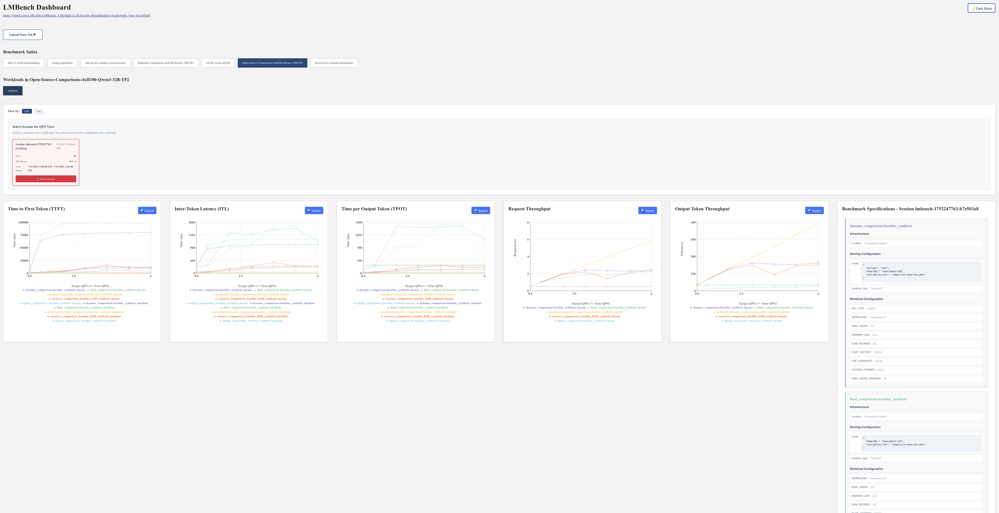

# LMBench: Modular LLM Serving Benchmarking Framework

[Dashboard: lmbench.dev](https://lmbench.dev/)


## Overview

LMBench is a benchmarking framework for [LMCache](https://github.com/LMCache/LMCache) and [vLLM Production Stack](https://github.com/vllm-project/production-stack) with external baseline comparison support (SGLang, Dynamo, RayServe, LLM-D etc.).

**Core Architecture**: Cartesian product evaluation of serving baselines × workload generators across configurable infrastructure.

## Key Definitions

- **Suite**: Cartesian product of serving baselines and workloads defined in `0-bench-specs/*.yaml`
- **Session**: Single deployment with unique `lmbench-session-id` for result tracking
- **Baseline**: Serving system exposing OpenAI-compatible API on `localhost:30080`
- **Workload**: Traffic generator simulating specific usage patterns

## Modular Structure

```
LMBench/
├── 0-bench-specs/           # Suite definitions (baselines × workloads)
│   └── TEMPLATE-spec.yaml   # All available options
├── 1-infrastructure/        # Platform setup (K8s clusters, cloud resources)
│   ├── lmcache-gke/        # Google Kubernetes Engine
│   ├── local-minikube/     # Local Kubernetes
│   └── local-flat/         # Direct script execution
├── 2-serving-engines/       # Baseline deployments
│   ├── helm-production-stack/    # vLLM Production Stack (Helm)
│   ├── direct-production-stack/  # vLLM Production Stack (Direct K8s Manifests)
│   ├── sglang/             # SGLang baseline
│   ├── dynamo/             # Dynamo baseline
│   ├── rayserve/           # RayServe baseline  
│   ├── llm-d/              # LLM-D baseline  
│   └── ADDING_NEW_BASELINES.md
├── 3-workloads/            # Traffic generators
│   ├── synthetic/          # Configurable multi-round QA
│   ├── agentic/           # Multi-agent conversations
│   ├── sharegpt/          # Real conversation data
│   ├── vllm-benchmark-serving/  # vLLM benchmark integration
│   └── ADDING_NEW_WORKLOADS.md
├── 4-latest-results/       # Benchmark outputs and post-processing
├── run-bench.py           # Main orchestrator
├── run-bench.yaml         # Top-level configuration
└── TEMPLATE-run-bench.yaml # Infrastructure options
```

## Quick Start

1. **Configure**: Edit `run-bench.yaml` to select suites and infrastructure
2. **Deploy**: `export HF_TOKEN=<token> && python run-bench.py`
3. **Results**: View `.png` graphs in `4-latest-results/<suite-name>/`

### Infrastructure Options
- **LMCacheGKE**: Managed GKE cluster with GPUs
- **LocalMinikube**: Local Kubernetes development
- **Local-Flat**: Direct script deployment (no containers)

### Example Configuration
```yaml
# run-bench.yaml
0-bench-specs:
  - layerwise/layerwise-spec.yaml

1-infrastructure:
  Location: LocalMinikube
```

## Extensibility

- **New Baselines**: See `2-serving-engines/ADDING_NEW_BASELINES.md`
- **New Workloads**: See `3-workloads/ADDING_NEW_WORKLOADS.md`  
- **New Suites**: Create spec files using `0-bench-specs/TEMPLATE-spec.yaml`

## Artifacts

Each session produces per-suite directories with:
```
suite-name/
├── {baseline}_{workload}_{qps}_{timestamp}.json  # Raw results
├── {workload}_comparison.png                     # Performance graphs
└── pod-logs/                                     # Infrastructure logs
```

## Dashboard and Uploading Results

Upload results to [lmbench.dev](https://lmbench.dev) for time-series analysis and cross-session comparison. Results are grouped by suite → workload with QPS and temporal views.
